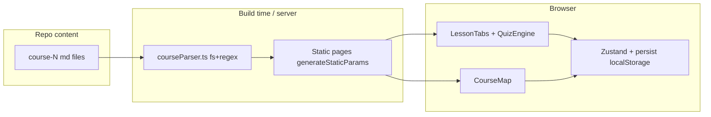

# Gamified Next.js Course Frontend

## Context & Constraints

- Content source: `course-1-python-basics/` (5 blocks, 21 lessons) and `course-2-web-apps/` (3 blocks, 11 lessons). Each lesson folder has `en.md` + `ru.md`.
- **No YAML frontmatter** — lesson metadata comes from the `# Title` heading and section headings. Parser is section/heading-based.
- Quiz format is uniform (added repo-wide earlier): `## Quick Check` / `## Проверь себя`, numbered questions with `- **a)** …` options, answers inside `
` as `1. **b)** explanation`. This parses cleanly into `{question, options[], correctIndex, explanation}`.
- Section heading variants the parser must handle: EN `Quick Drills / Practice Task / Try it yourself / Debug Corner / Quick Check / What's Next`; RU `Быстрые упражнения / Задание для практики / Уголок отладки / Проверь себя / Что дальше` (Block 1 lesson 1.1 RU uses `## Дальше`).
- All content is read server-side at build time (fs), pages statically generated via `generateStaticParams`. No backend; progress lives in localStorage.

## Architecture

## Step 1 — Scaffold & Core Infra

- `npx create-next-app@latest frontend` — TypeScript, Tailwind, App Router, `src/` dir. Then `shadcn init` + add components (button, card, tabs, progress, badge, dialog).
- Install: `gray-matter`, `react-markdown`, `remark-gfm`, `rehype-raw`, `framer-motion`, `canvas-confetti` (+types), `lucide-react`, `zustand`.
- Routing: `src/app/[lang]/…` with `lang ∈ {en, ru}`; root `/` redirects to `/en` (middleware or redirect page).
- i18n dictionary: `src/lib/i18n/{en,ru}.ts` + `getDict(lang)` helper for all UI chrome strings (tabs, buttons, XP labels, encouragement messages).
- Gamification store `src/stores/progressStore.ts` (Zustand + `persist`): `xp`, `level` (derived: `floor(xp/50)+1`), `completedLessons: string[]`, `completedQuizzes: string[]`, actions `addXp`, `completeLesson`, `completeQuiz`. Hydration-safe (skeleton until store hydrated to avoid SSR mismatch).
- `LanguageToggle.tsx` in navbar: swaps the `[lang]` URL segment of the current pathname via `router.push` — gamification state untouched (it lives in localStorage, not the route).

## Step 2 — Content Parser (`src/lib/courseParser.ts`)

- Resolve content root as `path.join(process.cwd(), "..")`; scan `course-*-*/block-*/lesson-*/` directories.
- Derive IDs from folder names (`course-1-python-basics` → `course-1`, `lesson-2-1-variables` → `lesson-2-1`, etc.); order by numeric prefixes (handle Course 2 `block-0`).
- Per lesson per language, split the markdown by `## ` headings into:
  - `theory` — title block + intro + numbered steps (everything before drills),
  - `assignments` — Quick Drills + Practice Task/Try it yourself + Debug Corner,
  - `quiz` — structured parse of Quick Check: question text, options a–d, correct letter + explanation from the `
` answer list.
- Strip cross-file markdown links that won't resolve in the app (e.g. `starter/…`, `README.md`) → render as plain text or repo-relative labels.
- Output typed model (`Course → Block → Lesson`) with explicit interfaces in `src/lib/types.ts`; add `prerequisiteId` = previous lesson in sequence (first lesson of each course has none).
- Quick validation script (`npm run validate-content`) that parses all 64 files and reports any lesson missing a quiz/section — guards against parsing anomalies.

## Step 3 — Roadmap UI

- `src/app/[lang]/page.tsx` — home: course cards + overall XP/level header.
- `src/app/[lang]/[courseId]/page.tsx` — `CourseMap.tsx`: blocks as themed zones, lessons as nodes on a winding path (CSS/SVG), framer-motion entrance animations.
- Node states from store: locked (padlock, muted) / unlocked (vibrant, pulsing) / completed (gold star or green check). Lesson N unlocks when lesson N−1 is in `completedLessons`.
- Kid-friendly styling: large type, pastel palette, `rounded-3xl`, generous spacing, emoji accents.

## Step 4 — Lesson Player & Quiz Engine

- `src/app/[lang]/[courseId]/[blockId]/[lessonId]/page.tsx` (server component, static params for all lang×lesson combos) → passes parsed lesson to client `LessonTabs.tsx`.
- Tabs (shadcn Tabs): "🚀 Theory" / "📝 Assignments" / "🎯 Quiz" — markdown rendered via `react-markdown` + `remark-gfm` with styled code blocks.
- Isolated, self-contained components (each with explicit TS interfaces + inline docs, for easy hand-off to other models):
  - `QuizEngine.tsx` — one question at a time, progress dots; correct → confetti + chime + advance; wrong → gentle hint (uses explanation text), no penalty; finish → `+10 XP` per lesson quiz (once), mark complete, celebratory summary.
  - `ConfettiTrigger.tsx` — wraps `canvas-confetti`.
  - `ChimePlayer.ts` — small Web Audio API util (graceful no-op if unavailable).
  - `XPBadge.tsx` — navbar XP/level with animated count-up.
  - `LessonLockGuard.tsx` — redirects/blocks locked lessons client-side.
- "Mark assignments done" button on Assignments tab → also feeds `completeLesson` (quiz completion auto-completes the lesson).

## Step 5 — Verify

- `npm run build` in `frontend/` must pass clean (all ~64+ static lesson pages generated).
- Smoke-check dev server: roadmap locking, quiz flow + confetti, RU/EN toggle preserving state, localStorage persistence across reload.
- Note: `frontend/` should be added to repo `.gitignore` only for `node_modules`/`.next` (Next defaults handle this in `frontend/.gitignore`).