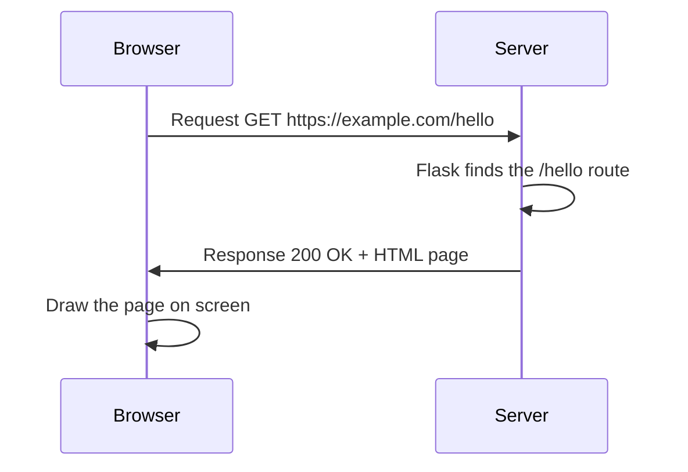

# Lesson 0.2: How the Web Works

> **Course:** Web Applications with Python · **Block:** Environment Setup · **~30–45 min**  
> [Choose language](README.md) · [Русский →](ru.md)

---

## Title

**Level 0 — The Web Workshop Tour**

---

## Explanation

Your **Web Workshop** has tools now (Lesson 0.1). Before you write Flask code, let's tour how the web actually works — like learning how mail travels before you build a mailbox.

Four ideas to remember:

| Term | Plain English |
|------|---------------|
| **Browser** | The app you use to open websites (Chrome, Firefox, Edge). It **sends requests** and **shows pages**. |
| **Server** | A program that **waits** for requests and **sends back** pages or data. Your Flask app will become a small server. |
| **URL** | The web address in the bar, like `https://example.com/hello`. It tells the browser **where** to ask. |
| **Request / Response** | The browser sends a **request** ("please give me `/hello`"). The server sends a **response** (the HTML page or an error). |

Here is the round trip:



**Request** = browser asking. **Response** = server answering. Status `200 OK` means "success — here is your page."

**Path A — PyCourse repo:**

```text
cd course-2-web-apps\block-0-environment-setup\lesson-0-2-how-the-web-works
```

**Path B — your own folder:** Copy [starter/web_quiz.py](starter/web_quiz.py) anywhere. Open VS Code on that folder.

This lesson uses **plain Python only** — no venv or Flask required to run the quiz.

---

### Step 1: Open web_quiz.py

Open [starter/web_quiz.py](starter/web_quiz.py). You will build a short quiz that checks whether you remember browser, server, and URL.

---

### Step 2: Plan the three questions

Each quiz item is a `(question, answer)` pair in a list. Answers are lowercase so you can compare with `.lower().strip()`.

Example ideas (you will write your own in the starter):

- Browser — the app that opens pages
- Server — waits for requests and sends responses
- URL — the web address you type

---

### Step 3: Loop and score

Use a `for` loop over your list. For each question:

1. Ask with `input()`
2. Compare the guess to the answer
3. Add 1 to `score` when correct

Print the final score like `Score: 2/3`.

---

### Step 4: Add the request/response demo

After the quiz, print a short story of one web trip — like the solution does. This connects your quiz answers to real Flask behavior in Block 1.

---

### Step 5: Run the quiz

```text
python starter\web_quiz.py
```

**Mac/Linux:** `python starter/web_quiz.py`

**Expected output (you type answers):**

```text
=== Web Workshop Quiz ===

What app on your computer opens pages and sends requests? browser
Correct!
What waits for requests and sends back pages or data? server
Correct!
What is the web address you type, like https://example.com? url
Correct!

Score: 3/3

=== Request / Response Demo ===
Browser: GET https://example.com/hello
Server:  Received request for /hello
Server:  Sending response (200 OK)
Browser: Displaying the page to you
```

---

## Code Example

**File: [solution/web_quiz.py](solution/web_quiz.py)**

```python
def main():
    print("=== Web Workshop Quiz ===")
    print()

    questions = [
        ("What app on your computer opens pages and sends requests?", "browser"),
        ("What waits for requests and sends back pages or data?", "server"),
        ("What is the web address you type, like https://example.com?", "url"),
    ]

    score = 0
    for question, answer in questions:
        guess = input(f"{question} ").lower().strip()
        if guess == answer:
            print("Correct!")
            score += 1
        else:
            print(f"Not quite — the answer is: {answer}")

    print()
    print(f"Score: {score}/{len(questions)}")
    print()
    print("=== Request / Response Demo ===")
    print("Browser: GET https://example.com/hello")
    print("Server:  Received request for /hello")
    print("Server:  Sending response (200 OK)")
    print("Browser: Displaying the page to you")


main()
```

---

## Code Execution

```text
cd course-2-web-apps\block-0-environment-setup\lesson-0-2-how-the-web-works
python starter\web_quiz.py
```

Type `browser`, `server`, and `url` when prompted (or try wrong answers to see the hints).

---

## Quick Drills

1. **Live URL** — open any site, copy the address bar text. Point to the part that is the domain (like `example.com`).
2. **Who talks first?** — in the mermaid diagram, who sends the request? Who sends the response?
3. **Rename a question** — change one quiz question to mention your favorite site, keep the same answer word.

---

## Practice Task

**Quest name:** Web Workshop Quiz Master

1. Complete all TODOs in [starter/web_quiz.py](starter/web_quiz.py).
2. Add a **fourth** question about **request** or **response** (answer: `request` or `response`).
3. If score is 3 or higher (or 4/4 if you added Q4), print `Ready for Flask!`

**Bonus stars:** After the demo, add one line: `print("Next: your Python code becomes the server!")`

**Reference solution:** [solution/web_quiz.py](solution/web_quiz.py)

---

## Debug Corner

**Problem:** The quiz always says "Not quite" even when you type the right word.

**Cause:** Extra spaces or capital letters — `Browser` is not the same as `browser` unless you use `.lower().strip()` on the guess.

**Fix:** Write `guess = input(...).lower().strip()` before comparing to `answer`.

---

**Problem:** `SyntaxError` near the `questions` list.

**Cause:** Missing comma between list items, or a quote mark that does not match.

**Fix:** Each tuple needs a comma after it: `("question text?", "answer"),`

---

## Quick Check

*Concept check — you also built the coding quiz in `web_quiz.py`. These questions test the ideas.*

Pick the best answer for each question. Try without scrolling down first!

1. In the browser–server story, who **sends the request** first?
   - **a)** Browser
   - **b)** Server
   - **c)** URL
   - **d)** pip

2. What is a **URL**?
   - **a)** The web address that tells the browser where to ask
   - **b)** A Python file that runs Flask
   - **c)** The HTML code inside a page
   - **d)** A kind of virtual environment

3. What does a **server** do in this lesson?
   - **a)** Waits for requests and sends back responses
   - **b)** Only draws pictures on your screen
   - **c)** Stores all your `.venv` folders
   - **d)** Replaces the need for a browser

4. In the round trip, what is a **response**?
   - **a)** What the server sends back (like an HTML page)
   - **b)** What you type into `input()` in the quiz
   - **c)** The name of the Flask install command
   - **d)** A broken link in the address bar

5. What does status **200 OK** usually mean?
   - **a)** Success — here is the page you asked for
   - **b)** The browser is offline
   - **c)** The server deleted the website
   - **d)** You must install Flask again

---

<details><summary>Click to reveal answers</summary>

1. **a)** The browser asks first; the server answers.
2. **a)** URL = the address bar text that points to a resource.
3. **a)** The server listens and replies with pages or data.
4. **a)** A response is what travels back from server to browser.
5. **a)** 200 OK means the request succeeded.

</details>

---

## What's Next

→ [Lesson 1.1: Installing Flask](../../block-1-web-basics-flask/lesson-1-1-installing-flask/README.md) — verify Flask inside your venv and get ready to serve pages.

---

*You know how browser and server talk. Next your Python code becomes the server!*

[← Choose language](README.md)
