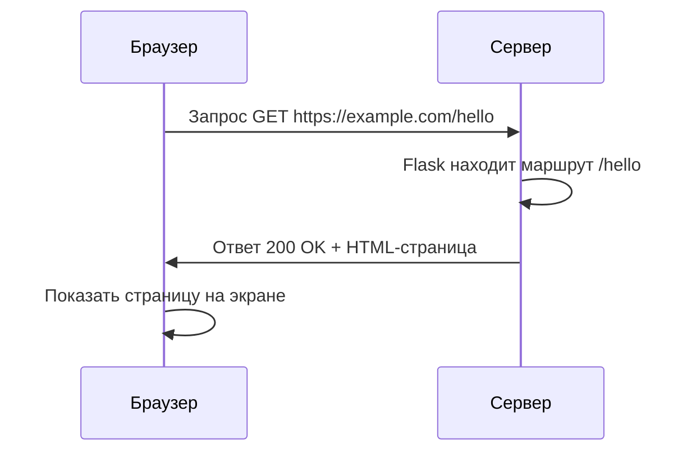

# Урок 0.2: Как работает веб

> **Курс:** Веб-приложения на Python · **Блок:** Настройка окружения · **~30–45 мин**  
> [Выбрать язык](README.md) · [English →](en.md)

---

## Заголовок

**Уровень 0 — Экскурсия по веб-мастерской**

---

## Объяснение

В **веб-мастерской** уже есть инструменты (Урок 0.1). Прежде чем писать код на Flask, разберём, как устроен веб — как понять почту, прежде чем делать почтовый ящик.

Четыре идеи на запоминание:

| Термин | Простыми словами |
|--------|------------------|
| **Браузер** | Программа для сайтов (Chrome, Firefox, Edge). **Отправляет запросы** и **показывает страницы**. |
| **Сервер** | Программа, которая **ждёт** запросы и **отправляет** страницы или данные. Твоё Flask-приложение станет маленьким сервером. |
| **URL** | Адрес в строке браузера, например `https://example.com/hello`. Говорит браузеру, **куда** обращаться. |
| **Запрос / ответ** | Браузер шлёт **запрос** («дай `/hello`»). Сервер шлёт **ответ** (HTML-страницу или ошибку). |

Вот полный цикл:



**Запрос** — вопрос браузера. **Ответ** — ответ сервера. Статус `200 OK` значит «успех — вот страница».

**Путь A — репозиторий PyCourse:**

```text
cd course-2-web-apps\block-0-environment-setup\lesson-0-2-how-the-web-works
```

**Путь B — своя папка:** скопируй [starter/web_quiz.py](starter/web_quiz.py) куда угодно. Открой папку в VS Code.

Для квиза нужен **обычный Python** — venv и Flask не обязательны.

---

### Шаг 1: Открой web_quiz.py

Открой [starter/web_quiz.py](starter/web_quiz.py). Ты соберёшь короткий квиз про браузер, сервер и URL.

---

### Шаг 2: Спланируй три вопроса

Каждый пункт квиза — пара `(вопрос, ответ)` в списке. Ответы в нижнем регистре, чтобы сравнивать через `.lower().strip()`.

Примеры идей (в starter напишешь свои):

- Браузер — программа, которая открывает страницы
- Сервер — ждёт запросы и отправляет ответы
- URL — веб-адрес, который ты вводишь

---

### Шаг 3: Цикл и счёт

Пройди список в цикле `for`. Для каждого вопроса:

1. Спроси через `input()`
2. Сравни ответ игрока с эталоном
3. При совпадении добавь 1 к `score`

В конце напечатай счёт, например `Score: 2/3`.

---

### Шаг 4: Добавь демо запроса и ответа

После квиза напечатай короткую историю одного веб-путешествия — как в решении. Это свяжет квиз с Flask в Блоке 1.

---

### Шаг 5: Запусти квиз

```text
python starter\web_quiz.py
```

**Mac/Linux:** `python starter/web_quiz.py`

**Ожидаемый вывод (ты вводишь ответы):**

```text
=== Web Workshop Quiz ===

What app on your computer opens pages and sends requests? browser
Correct!
What waits for requests and sends back pages or data? server
Correct!
What is the web address you type, like https://example.com? url
Correct!

Score: 3/3

=== Request / Response Demo ===
Browser: GET https://example.com/hello
Server:  Received request for /hello
Server:  Sending response (200 OK)
Browser: Displaying the page to you
```

---

## Пример кода

**Файл: [solution/web_quiz.py](solution/web_quiz.py)**

```python
def main():
    print("=== Web Workshop Quiz ===")
    print()

    questions = [
        ("What app on your computer opens pages and sends requests?", "browser"),
        ("What waits for requests and sends back pages or data?", "server"),
        ("What is the web address you type, like https://example.com?", "url"),
    ]

    score = 0
    for question, answer in questions:
        guess = input(f"{question} ").lower().strip()
        if guess == answer:
            print("Correct!")
            score += 1
        else:
            print(f"Not quite — the answer is: {answer}")

    print()
    print(f"Score: {score}/{len(questions)}")
    print()
    print("=== Request / Response Demo ===")
    print("Browser: GET https://example.com/hello")
    print("Server:  Received request for /hello")
    print("Server:  Sending response (200 OK)")
    print("Browser: Displaying the page to you")


main()
```

---

## Запуск кода

```text
cd course-2-web-apps\block-0-environment-setup\lesson-0-2-how-the-web-works
python starter\web_quiz.py
```

Вводи `browser`, `server` и `url` (или ошибись специально, чтобы увидеть подсказки).

---

## Быстрые упражнения

1. **Живой URL** — открой любой сайт, посмотри строку адреса. Где домен (например `example.com`)?
2. **Кто первый?** — на диаграмме mermaid кто отправляет запрос? Кто — ответ?
3. **Свой вопрос** — переформулируй один вопрос про любимый сайт, ответ оставь тем же словом.

---

## Практическое задание

**Квест:** Мастер веб-квиза

1. Выполни все TODO в [starter/web_quiz.py](starter/web_quiz.py).
2. Добавь **четвёртый** вопрос про **request** или **response** (ответ: `request` или `response`).
3. Если счёт 3 и выше (или 4/4 с четвёртым вопросом), напечатай `Ready for Flask!`

**Бонус:** после демо добавь строку: `print("Next: your Python code becomes the server!")`

**Эталонное решение:** [solution/web_quiz.py](solution/web_quiz.py)

---

## Разбор ошибок

**Проблема:** Квиз всегда пишет «Not quite», хотя слово верное.

**Причина:** Лишние пробелы или заглавные буквы — `Browser` не равно `browser`, если не применить `.lower().strip()` к ответу.

**Решение:** Пиши `guess = input(...).lower().strip()` перед сравнением с `answer`.

---

**Проблема:** `SyntaxError` рядом со списком `questions`.

**Причина:** Пропущена запятая между элементами или непарная кавычка.

**Решение:** После каждого кортежа нужна запятая: `("текст вопроса?", "ответ"),`

---

## Проверь себя

*Проверка понятий — кодовый квиз ты также собираешь в `web_quiz.py`. Здесь проверяем идеи.*

Выбери лучший ответ на каждый вопрос. Сначала попробуй без подсказок!

1. В цепочке браузер–сервер кто **первым отправляет запрос**?
   - **a)** Браузер
   - **b)** Сервер
   - **c)** URL
   - **d)** pip

2. Что такое **URL**?
   - **a)** Веб-адрес, который говорит браузеру, куда обращаться
   - **b)** Python-файл, который запускает Flask
   - **c)** HTML-код внутри страницы
   - **d)** Вид виртуального окружения

3. Что делает **сервер** в этом уроке?
   - **a)** Ждёт запросы и отправляет ответы
   - **b)** Только рисует картинки на экране
   - **c)** Хранит все твои папки `.venv`
   - **d)** Заменяет браузер

4. В полном цикле что такое **ответ (response)**?
   - **a)** То, что сервер отправляет обратно (например HTML-страницу)
   - **b)** То, что ты вводишь в `input()` в квизе
   - **c)** Название команды установки Flask
   - **d)** Битая ссылка в адресной строке

5. Что обычно значит статус **200 OK**?
   - **a)** Успех — вот страница, которую ты запросил
   - **b)** Браузер без интернета
   - **c)** Сервер удалил сайт
   - **d)** Нужно снова установить Flask

---

<details><summary>Нажми, чтобы увидеть ответы</summary>

1. **a)** Сначала спрашивает браузер; отвечает сервер.
2. **a)** URL — текст в адресной строке, указывающий на ресурс.
3. **a)** Сервер слушает и отвечает страницами или данными.
4. **a)** Ответ — то, что идёт обратно от сервера к браузеру.
5. **a)** 200 OK значит, что запрос прошёл успешно.

</details>

---

## Что дальше

→ [Урок 1.1: Установка Flask](../../block-1-web-basics-flask/lesson-1-1-installing-flask/README.md) — проверь Flask в venv и готовься отдавать страницы.

---

*Ты знаешь, как говорят браузер и сервер. Дальше сервером станет твой Python!*

[← Выбрать язык](README.md)
