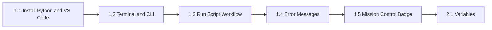

# Plan: Block 1 — Lessons 1.2–1.5 (Revised)

**Status:** implemented  
**Date:** 2026-06-06  
**Target:** Course 1, Block 1 — Meeting Your Computer's Best Friend  
**Supersedes:** `.cursor/plans/block_1_lessons_1a20b38e.plan.md`

## Goal

Complete Block 1 for age-11+ learners with five lessons (1.2–1.5) that:

- Add **new skills** each lesson (not repeat 1.1 walkthroughs under new titles)
- End every lesson with a **runnable result** (pedagogy + curriculum requirement)
- Provide **tiered practice** (quick drills + main quest + bonus) for CLI/path literacy
- Keep error-debugging in Block 1 scope (no `if` or variables before their official blocks)
- Gate Block 2 with a **capstone quest** and a block-level readiness checklist

**Lesson 1.1 stays unchanged.**

When done: `CURRICULUM.md` updated with Lesson 1.5; all lesson folders, block index, Block 2 placeholder, and cross-links verified.

---

## Changes from original plan (why)

| Issue | Original plan | Revised plan |
|-------|---------------|--------------|
| 1.2 not runnable | Terminal-only, no Python | End with `treasure.py` + `starter/`/`solution/` |
| 1.1 ↔ 1.3 overlap | Another 3-line `print()` intro script | Workflow debugging (wrong folder, `.txt` extension, two files) |
| 1.4 scope creep | `if` bug + variable `NameError` | `print()`/`SyntaxError` + CLI `can't open file` only |
| Thin practice | One quest per lesson | Quick drills + main quest + bonus in every lesson |
| Treasure Hunt | Assumes PyCourse repo layout only | Dual path: repo layout **or** student-created folders |
| Block closure | Jump straight to Block 2 | Lesson 1.5 capstone + Block 1 checklist |
| Block index | Optional | **Required** |
| `exercises/` | Only in 1.4 | In 1.2, 1.3, and 1.4 |

---

## Standard lesson package

Each lesson follows [write-lesson skill](../../.cursor/skills/write-lesson/SKILL.md):

```
lesson-{B}-{L}-{slug}/
├── README.md      # Language chooser + parent/student orientation (see below)
├── en.md          # Full English lesson
├── ru.md          # Full Russian lesson
├── starter/       # Runnable code (required when Python is used)
├── solution/      # Reference answer
└── exercises/     # Optional micro-challenges (1.2, 1.3, 1.4)
```

### README pattern (richer than chooser-only)

Match 1.1 chooser layout, **plus** on every lesson `README.md`:

1. **What you'll build** — one sentence + expected output
2. **What you'll learn** — 3–5 bullets
3. **Before you start** — prerequisite checklist (tick boxes)
4. **Files in this lesson** — table linking `en.md`, `ru.md`, starters
5. **Quick drills** — 2–3 two-minute warm-ups (link or inline)
6. Link to next lesson chooser

Full step-by-step stays in `en.md` / `ru.md` (1.1 pattern).

### Required sections in `en.md` / `ru.md`

1. **Title** — gamified level name
2. **Explanation** — 5–8 numbered steps; terminal = maze/portal, folders = rooms, errors = clues
3. **Code Example** — commented Python where relevant; **no emojis inside code blocks**
4. **Code Execution** — CLI commands in `text` blocks; **expected output after every block**
5. **Quick drills** — 2–3 short repetitions of the lesson skill
6. **Practice Task** — main quest + optional bonus
7. **Debug Corner** — one common mistake + cause + fix
8. **What's Next** — next lesson's `README.md` (not `en.md`/`ru.md`)

Header:

```markdown
> **Course:** ... · **Block:** ... · **~30–45 min**
> [Choose language](README.md) · [Other lang →](ru.md|en.md)
```

Footer: link back to `README.md`.

### Differentiation from Lesson 1.1 (must be explicit in copy)

| Lesson | What 1.1 already did | What this lesson adds |
|--------|----------------------|------------------------|
| 1.2 | Opened terminal; one `cd` example | `cd ..`, read prompt path, `dir`/`ls`, `cls`/`clear`, tab-completion tip |
| 1.3 | Created `hello.py`; ran once | Full save workflow, Run button vs terminal, diagnose wrong folder / wrong name |
| 1.4 | “Read error like a detective” hint | Structured traceback reading; fix three provided bugs |
| 1.5 | — | Integrate all Block 1 skills in one capstone |

---

## Lesson flow



---

## Lesson-by-lesson content plan

### Lesson 1.2 — Using the Terminal/CLI

**Path:** `lesson-1-2-using-the-terminal/`  
**Time:** ~30–45 min  
**Curriculum outcome:** Navigate folders with `cd` / `cd ..`; list files with `dir` / `ls`

| Section | Content |
|---------|---------|
| Title EN | Level 2 — Navigate the Folder Maze |
| Title RU | Уровень 2 — Лабиринт папок |
| Explanation | Recap: terminal = Command Portal. **New:** `cd ..`, reading path in prompt, `dir` (Windows) + `ls` (Mac/Linux note), `cls`/`clear`, tab to autocomplete folder names |
| Code Example | “Command scroll” block for terminal commands **plus** `starter/treasure.py` (1-line victory script) |
| Code Execution | Navigate to folder containing `treasure.py`; `dir`; run `python treasure.py` → `Treasure found!` |
| Quick drills | (1) `cd` to Desktop and back with `cd ..` (2) `dir` — count `.py` files (3) Write the folder path shown in your prompt |
| Practice Task | **Quest: Treasure Hunt** — **Path A (PyCourse):** navigate to `block-1-meeting-your-computer`, list lessons, find `lesson-1-1-installing-python`, return up one level. **Path B (any setup):** create `quests/treasure/` on Desktop, place `clue.txt`, navigate there with `cd`, `dir`, read clue |
| Bonus | Draw a paper “map” of 4 folders from your project; label where `treasure.py` lives |
| Debug Corner | `The system cannot find the path specified` — typo in folder name or wrong path |
| Files | `README.md`, `en.md`, `ru.md`, `starter/treasure.py`, `solution/treasure.py`, `exercises/quest_paths.md` (tick-box checklist) |

**Prerequisite:** 1.1 — VS Code terminal open, Python works.

---

### Lesson 1.3 — Running Your First Script (Workflow Mastery)

**Path:** `lesson-1-3-running-your-first-script/`  
**Time:** ~30–45 min  
**Curriculum outcome:** Reliable create → save → `cd` → `python file.py` workflow

| Section | Content |
|---------|---------|
| Title EN | Level 3 — Master the Launch Sequence |
| Title RU | Уровень 3 — Освой последовательность запуска |
| Explanation | **Not** “what is print” (1.1 covered that). Focus: `.py` extension, Save vs Save As, Explorer vs terminal view of same folder, `cd` to script folder, `python file.py`, VS Code Run button vs terminal |
| Code Example | `starter/hello.py` (same 3-line pattern as 1.1 — reference file, not new concept) |
| Code Execution | `cd` to lesson folder → `python hello.py` → show 3-line output; show `python --version` from same folder |
| Quick drills | (1) Run `hello.py` from wrong folder — observe error (2) `dir` and confirm `hello.py` is listed (3) Run again from correct folder |
| Practice Task | **Quest: Double Launch** — create `launch.py` (2 `print()` lines: greeting + hobby). Save correctly (not `.py.txt`). Run **both** `hello.py` and `launch.py` in sequence from the same folder |
| Bonus | Rename file to `launch.py.txt` on purpose; fix until `python launch.py` works. Use VS Code “Copy path” to verify folder |
| Debug Corner | `python: can't open file` — wrong folder, wrong filename, or file saved as `.txt` |
| Files | `README.md`, `en.md`, `ru.md`, `starter/hello.py`, `solution/hello.py`, `solution/launch.py`, `exercises/wrong_folder_scenarios.md` (3 scripted “fix it” scenarios) |

**Copy note:** “You met this spell in Level 1. Now you master **where** and **how** to launch it every time.”

---

### Lesson 1.4 — Reading Error Messages

**Path:** `lesson-1-4-reading-error-messages/`  
**Time:** ~30–45 min  
**Curriculum outcome:** Fix 3 intentional bugs; learn **SyntaxError** vs **CLI file errors** (not NameError — that waits for Block 2)

| Section | Content |
|---------|---------|
| Title EN | Level 4 — Error Detective Academy |
| Title RU | Уровень 4 — Академия детективов ошибок |
| Explanation | Errors are clues. Read traceback bottom-up. Two families this lesson: **Python SyntaxError** (code grammar) vs **can't open file** (terminal/path). How to use `File "...", line N` in VS Code |
| Code Example | Three buggy scripts in `starter/`: |
| | `bug_missing_quote.py` → **SyntaxError** (unclosed `"` in `print`) |
| | `bug_missing_paren.py` → **SyntaxError** (missing `)` in `print`) |
| | `bug_wrong_filename.py` → **CLI error** — lesson text tells student to run `python wrong_name.py` while file is named `right_name.py` |
| Code Execution | Run each case, read error, fix, re-run until success |
| Quick drills | (1) Spot the missing quote in a one-line snippet (2) Find line number in a sample traceback (3) `cd` to wrong folder, run script, fix by moving to correct folder |
| Practice Task | **Quest: Three Case Files** — fix all three starters without peeking at solutions |
| Bonus | In `exercises/bug_bad_indent.py` — optional **IndentationError** stretch (explain only in bonus section, not main lesson) |
| Debug Corner | `File "...", line N` — Ctrl+G (Go to line) in VS Code |
| Files | `starter/` (3 buggy `.py`), `solution/` (3 fixed), `exercises/bug_bad_indent.py` + `exercises/bug_bad_indent_solution.py` |

**Constraint:** Each buggy script ≤15 lines. **Only** `print()` and comments in Python files — no `if`, no variables.

**Deferred to Block 2 sidebar or Lesson 2.1 refresher:** `NameError` from variable typos.

---

### Lesson 1.5 — Block 1 Capstone *(new)*

**Path:** `lesson-1-5-mission-control-badge/`  
**Time:** ~45 min  
**Curriculum outcome:** Integrate navigation, script creation, execution, and one self-inflicted bug fix

| Section | Content |
|---------|---------|
| Title EN | Level 5 — Earn Your Mission Control Badge |
| Title RU | Уровень 5 — Значок диспетчера миссии |
| Explanation | Recap Block 1 skills as a single “mission”: create folder, write script, navigate, run, break and fix |
| Code Example | `starter/badge.py` skeleton with `# TODO` comments (5–8 `print()` lines — ASCII banner or short story) |
| Code Execution | `mkdir my_mission` (or create in VS Code) → `cd my_mission` → save `badge.py` → `python badge.py` |
| Quick drills | Block 1 checklist (see Block README) — student ticks each skill |
| Practice Task | **Quest: Mission Control Badge** — (1) Create `my_mission/` (2) Write `badge.py` with 5–8 `print()` lines (3) Navigate with `cd`, confirm with `dir` (4) Run successfully (5) Introduce one bug on purpose, read error, fix, re-run |
| Bonus | Screenshot or show output to a friend/parent; add one joke line to `badge.py` |
| Debug Corner | “It worked once, now it doesn't” — file not saved, or terminal in wrong folder after creating new folder |
| Files | `README.md`, `en.md`, `ru.md`, `starter/badge.py`, `solution/badge.py` |

**Block 1 gate:** Student should complete checklist before starting Block 2.

---

## Block index (required)

**Path:** `course-1-python-basics/block-1-meeting-your-computer/README.md`

Bilingual table linking all five lesson choosers (1.1–1.5).

### Block 1 readiness checklist (embed in block README)

Student (or parent) ticks before Block 2:

- [ ] `python --version` shows a version number
- [ ] I can open the terminal in VS Code
- [ ] I can `cd` into a folder and `cd ..` to go back
- [ ] I can `dir` (or `ls`) and find a `.py` file
- [ ] I can run `python myfile.py` and see output
- [ ] I know why `can't open file` happens and how to fix it
- [ ] I can read `line N` in an error and jump to that line
- [ ] I completed `badge.py` in Lesson 1.5

### Parent appendix (short section in block README)

- Save vs Save As; confirm extension is `.py` not `.py.txt`
- Explorer and terminal show the **same** folder — compare paths
- “Add to PATH” reminder if `python` not recognized (link to 1.1 Debug Corner)

---

## Cross-lesson linking

| From | What's Next |
|------|-------------|
| 1.1 `en.md` / `ru.md` | `../lesson-1-2-using-the-terminal/README.md` (already linked) |
| 1.2 | `../lesson-1-3-running-your-first-script/README.md` |
| 1.3 | `../lesson-1-4-reading-error-messages/README.md` |
| 1.4 | `../lesson-1-5-mission-control-badge/README.md` |
| 1.5 | `../../block-2-talking-to-python/lesson-2-1-variables/README.md` |

**Block 2 placeholder:** `course-1-python-basics/block-2-talking-to-python/lesson-2-1-variables/README.md` — chooser only (“Coming soon”) so links are not broken.

---

## CURRICULUM.md update (required)

Add to Block 1 table:

| Lesson | Topic | Mini-project / outcome |
|--------|-------|------------------------|
| 1.5 | Block 1 Capstone: Mission Control Badge | Create `my_mission/badge.py`; navigate, run, fix one bug |

Adjust 1.4 outcome row:

- **Was:** Fix 3 bugs; learn SyntaxError vs NameError  
- **Now:** Fix 3 bugs; learn SyntaxError vs CLI file errors

---

## Quality checklist (per lesson)

Apply [youth-python-pedagogy](../../.cursor/skills/youth-python-pedagogy/SKILL.md) and [review-lesson](../../.cursor/skills/review-lesson/SKILL.md):

- [ ] One primary concept per lesson
- [ ] ~30–45 min; 5–8 numbered steps in Explanation
- [ ] **Runnable result every lesson** (including 1.2 `treasure.py`)
- [ ] Expected output after every command/code block
- [ ] Quick drills (2–3) + main quest + bonus
- [ ] Starter runs without errors; solution matches README
- [ ] Windows-first CLI; brief Mac/Linux notes
- [ ] No type hints; no pip packages; no `if`/variables before Block 2 (except 1.4 stretch in `exercises/` only)
- [ ] Debug corner with real error example
- [ ] What's Next → next lesson `README.md`

---

## Implementation steps

- [x] Update `CURRICULUM.md` — Lesson 1.5 row + revised 1.4 outcome
- [x] Create `block-1-meeting-your-computer/README.md` (index + checklist + parent appendix)
- [x] Create lesson 1.2 (`README`, `en`, `ru`, `starter/treasure.py`, `solution/treasure.py`, `exercises/quest_paths.md`)
- [x] Create lesson 1.3 (`README`, `en`, `ru`, starters/solutions, `exercises/wrong_folder_scenarios.md`)
- [x] Create lesson 1.4 (3 buggy starters + solutions, optional indent exercise)
- [x] Create lesson 1.5 capstone (`badge.py` starter/solution)
- [x] Create Block 2 placeholder `lesson-2-1-variables/README.md`
- [x] Verify all cross-lesson links (1.1 → 1.5 → 2.1 placeholder)
- [x] Run all Python starters and solutions from their lesson folders

---

## Dependencies

- Lesson 1.1 complete (unchanged)
- [write-lesson](../../.cursor/skills/write-lesson/SKILL.md), [youth-python-pedagogy](../../.cursor/skills/youth-python-pedagogy/SKILL.md), [review-lesson](../../.cursor/skills/review-lesson/SKILL.md)

---

## Open questions

- Should `NameError` move to Lesson 2.1 as a “remember debugging?” sidebar, or become a small Block 2 Lesson 2.0 refresher?
- After implementation, user-test 1.2 Treasure Hunt Path B on a machine **without** the PyCourse repo clone.

---

## Done criteria

- [x] Lessons 1.2–1.5 exist with bilingual `README.md`, `en.md`, `ru.md`
- [x] Every lesson with Python has runnable `starter/` and `solution/`
- [x] Block 1 README lists all five lessons + readiness checklist
- [x] `CURRICULUM.md` reflects 1.5 and revised 1.4 outcome
- [x] Block 2 placeholder README exists; no broken What's Next links
- [x] All Python scripts run with `python filename.py` from the correct lesson folder
- [x] [review-lesson](../../.cursor/skills/review-lesson/SKILL.md) checklist passes for each new lesson

---

## Deliverables summary

| Item | New files (approx.) |
|------|---------------------|
| 1.2 | 3 markdown + 2 Python + 1 exercise md |
| 1.3 | 3 markdown + 3 Python + 1 exercise md |
| 1.4 | 3 markdown + 6–7 Python |
| 1.5 | 3 markdown + 2 Python |
| Block index | 1 markdown |
| Block 2 placeholder | 1 markdown |
| `CURRICULUM.md` | 1 edit |
| **Total** | ~24 files + 1 curriculum edit |

**Not in scope:** Editing Lesson 1.1 content; Block 2 full lessons; git commit (unless requested).
