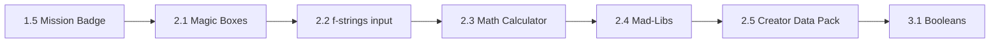

# Plan: Block 2 — Talking to Python (Variables & Data)

**Status:** implemented  
**Date:** 2026-06-06  
**Target:** Course 1, Block 2 — Talking to Python (Variables & Data)  
**Supersedes:** (none — first Block 2 plan)

## Goal

Complete **Course 1, Block 2: Talking to Python (Variables & Data)** for age 11+ with **five lessons (2.1–2.5)**:

- Introduce **variables**, **input**, **f-strings**, **math**, **string methods** in order
- Every lesson ends with a **runnable terminal program**
- **Lesson 2.5** is the block capstone (user choice — separate from 2.4 Mad-Libs)
- Gate Block 3 with a **Block 2 readiness checklist** (mirror Block 1)
- Apply Block 1 fixes: bilingual split, Path A/B, RU exercise sheets, STUDENT-MAP, consistent `starter/` layout

**Prerequisite:** [Block 1 readiness checklist](../../course-1-python-basics/block-1-meeting-your-computer/README.md#block-1-readiness-checklist) complete.

When done: `CURRICULUM.md` updated with Lesson 2.5; all lesson folders, block index, Block 3 placeholder, and cross-links verified.

---

## Lessons from CURRICULUM.md + capstone

| Lesson | Topic | Mini-project / outcome |
|--------|-------|------------------------|
| 2.1 | Variables, Strings, Integers | `character_sheet.py` — store name, age, favorite game; print with labels |
| 2.2 | f-strings and `input()` | Interactive greeting — user types name; program responds |
| 2.3 | Math Operators | Terminal calculator — two numbers, one operation |
| 2.4 | Strings in Action | Mad-Libs in terminal (`.upper()`, `.lower()`, slicing basics) |
| **2.5** *(new)* | **Block 2 Capstone: Creator Data Pack** | Multi-field profile script using all Block 2 skills |

**CURRICULUM.md update (required):** Add Lesson 2.5 row to Block 2 table.

---

## Lesson flow



---

## Standard lesson package (inherit from Block 1)

Path: `course-1-python-basics/block-2-talking-to-python/lesson-{B}-{L}-{slug}/`

```
README.md      # Chooser + What you'll build/learn + Before you start + Quick drills
en.md / ru.md  # Full lesson (8 sections — see Block 1 plan)
starter/       # Runnable skeleton (# TODO where student fills in)
solution/      # Reference answer
exercises/     # Optional EN + RU micro-challenges (2.3, 2.4, 2.5)
```

Apply [write-lesson](../../.cursor/skills/write-lesson/SKILL.md), [youth-python-pedagogy](../../.cursor/skills/youth-python-pedagogy/SKILL.md).

**Block 1 lessons learned (must apply):**

- Scripts that run together live in the **same folder** (`starter/`); commands must match on-disk layout
- **Path B** callout in every lesson for non-repo learners
- **Exercise sheets in EN + RU** (`*.md` + `*.ru.md`)
- **NameError** debug corner allowed from 2.1 onward (variables official)
- No `if`/`for`/`def` until Block 3+ (capstone 2.5 uses sequential input only)
- No type hints (still Course 1)
- Max ~25–40 lines per main example in Block 2 early lessons; ~50 for 2.5 capstone
- Placeholder `print()` in empty starters so silent runs do not confuse beginners

---

## Gamified analogies (Block 2 theme: **Data Lab**)

| Concept | Analogy |
|---------|---------|
| Variable | Labeled magic box / storage locker |
| `=` | Put a value in the box |
| `input()` | Ask the visitor a question through the mic |
| f-string | Fill-in-the-blank scroll |
| Math operators | Calculator spell |
| `.upper()` / slicing | Text transformer machine |

---

## Lesson-by-lesson content plan

### Lesson 2.1 — Variables, Strings, Integers

**Path:** `lesson-2-1-variables/`  
**Time:** ~30–45 min  
**Outcome:** `starter/character_sheet.py` prints labeled data from variables

| Section | Content |
|---------|---------|
| Title EN | Level 6 — Magic Boxes for Your Data |
| Explanation | What is a variable; `name = "Alex"`; strings in quotes; integers without quotes; reuse variable in multiple `print()` lines; **do not use `input()` yet** |
| Code Example | 3 variables: `name`, `age`, `favorite_game`; print each with labels |
| Code Execution | `cd` to lesson; `python starter\character_sheet.py` |
| Quick drills | Change age number; add fourth variable `school`; predict output before run |
| Practice | Edit to **your** data; add one `print()` combining two variables with `,` (preview before f-strings) |
| Debug Corner | **NameError** — typo in variable name (`name` vs `nmae`) |
| Files | `starter/character_sheet.py`, `solution/character_sheet.py` |

**Differentiation from Block 1:** No install/CLI teaching — one line: "You already know launch sequence from Block 1."

**Cross-link (Amendment 1):** In en/ru, note that Level 1 `my_intro.py` printed text directly; variables let you **store** data in labeled boxes and reuse it.

**Differentiation from Lesson 1.1 `my_intro.py`:** Block 1 printed your name as a **literal** inside `print("Alex")`. Now you store data in **variables** and reuse them — same idea, labeled magic boxes (amendment A1).

---

### Lesson 2.2 — f-strings and `input()`

**Path:** `lesson-2-2-f-strings-and-input/`  
**Outcome:** `greeting.py` asks name and age; responds with f-string

| Section | Content |
|---------|---------|
| Title EN | Level 7 — Ask and Answer |
| New skills | `input("prompt")`, f-strings `f"Hello, {name}!"` |
| Code Example | Two inputs; two f-string responses |
| Practice | Add third question (favorite color); bonus: multiline f-string with `\n` |
| Debug Corner | Forgetting `f` prefix → literal `{name}` printed |
| Note | `input()` returns **string** — foreshadow 2.3 `int()` |

---

### Lesson 2.3 — Math Operators

**Path:** `lesson-2-3-math-operators/`  
**Outcome:** `calculator.py` — two numbers, print sum/difference/product/quotient

| Section | Content |
|---------|---------|
| Title EN | Level 8 — Calculator Spells |
| New skills | `+`, `-`, `*`, `/`; `int()` to convert input strings to numbers |
| Code Example | `num1 = int(input(...))` pattern |
| Practice | Solution shows all four ops; **practice quest** may shorten to + and * only (amendment A3) |
| Debug Corner | `ValueError` when non-numeric input (brief, friendly) |
| Exercise | `exercises/mental_math.md` + `.ru.md` — predict results before running |

**Scope limit:** Integer division shown as `/` with decimal result; no `//` or `%` unless bonus sidebar.

---

### Lesson 2.4 — Strings in Action (Mad-Libs)

**Path:** `lesson-2-4-strings-in-action/`  
**Outcome:** `madlibs.py` — 4–5 inputs, story template with `.upper()`, `.lower()`, slicing

| Section | Content |
|---------|---------|
| Title EN | Level 9 — Story Factory |
| New skills | `.upper()`, `.lower()`, slicing `[0:3]` on one word |
| Code Example | Short silly story (game theme) |
| Practice | Student writes own 3-sentence template; **new script** `madlibs.py` — not an extension of 2.2 `greeting.py` *(Amendment 3)* |
| Debug Corner | IndexError on bad slice — bonus in `exercises/slice_practice.md` + `.ru.md` (amendment A4) |

---

### Lesson 2.5 — Block 2 Capstone: Creator Data Pack

**Path:** `lesson-2-5-creator-data-pack/`  
**Time:** ~45 min  
**Outcome:** `my_data/creator_pack.py` at **project root** (student creates folder like Block 1 `my_mission`) *(Amendment 2)*

| Section | Content |
|---------|---------|
| Title EN | Level 10 — Pack Your Creator Data |
| Integrates | variables, multiple `input()`, f-strings, one calculation (e.g. `age * 365` days), one string transform |
| Steps | Create `my_data/` at **project root** (Path A) or Desktop (Path B); write 8–12 line script; save; cd; run; break one string quote; fix (amendment A2) |
| Checklist | Link to Block 2 readiness checklist on block README |
| Debug Corner | `input()` + math without `int()` → string concatenation surprise (teachable moment) |
| Exercises | `exercises/debug_quotes.md` + `.ru.md` — break/fix quote challenge *(Amendment 5)* |

**Example output sketch:**

```text
=== CREATOR DATA PACK ===
Name: Alex
Favorite game: Minecraft
Days on Earth (about): 4015
Shout: ALEX RULES!
Block 2 complete!
```

---

## Block infrastructure (required deliverables)

| File | Purpose |
|------|---------|
| `block-2-talking-to-python/README.md` | Lesson index + **Block 2 readiness checklist** |
| `STUDENT-MAP.md` + `.ru.md` | Folder tree for Block 2 + Path B |
| `CURRICULUM.md` | Add 2.5 capstone row |
| `AGENTS.md` | Block 2 lesson table + development order |
| Replace 2.1 placeholders | Full content replaces current "coming soon" stubs |

**Block 2 readiness checklist (draft items):**

- [ ] I can create variables and print them
- [ ] I can use `input()` and f-strings together
- [ ] I can convert input to numbers with `int()` for math
- [ ] I know `.upper()` and basic slicing
- [ ] I completed `creator_pack.py` in Lesson 2.5

---

## Implementation order (after plan approved)

1. Update `CURRICULUM.md` + `AGENTS.md`
2. Create block README + STUDENT-MAP
3. Lessons **2.1 → 2.2 → 2.3 → 2.4 → 2.5** (each: README, en, ru, starter, solution, exercises where noted)
4. Cross-link: 1.5 → 2.1 → … → 2.5 → Block 3 placeholder (`lesson-3-1-booleans`)
5. Run all Python scripts; run review-lesson checklist per lesson
6. Mark plan `**Status:** implemented**`; tick implementation steps in plan file

---

## Implementation steps

- [x] Update `CURRICULUM.md` — add Lesson 2.5 capstone row
- [x] Update `AGENTS.md` — Block 2 five-lesson table + development order
- [x] Create `block-2-talking-to-python/README.md` (index + checklist)
- [x] Create `STUDENT-MAP.md` + `STUDENT-MAP.ru.md`
- [x] Build lesson 2.1 — variables (`character_sheet.py`)
- [x] Build lesson 2.2 — f-strings and input (`greeting.py`)
- [x] Build lesson 2.3 — math operators (`calculator.py` + exercises)
- [x] Build lesson 2.4 — strings in action (`madlibs.py`)
- [x] Build lesson 2.5 — capstone (`creator_pack.py` + `my_data/` pattern)
- [x] Create Block 3 placeholder `lesson-3-1-booleans`
- [x] Update Block 1 README next-block link *(Amendment 6 — remove "coming soon")*
- [x] Run all starter/solution scripts
- [x] Verify cross-lesson links 1.5 → 2.1 → … → 2.5 → 3.1

---

## Done criteria

- [x] Lessons 2.1–2.5 exist with bilingual README, en.md, ru.md
- [x] Every lesson has runnable starter/ solution
- [x] Block 2 README + checklist + STUDENT-MAP (EN/RU)
- [x] `CURRICULUM.md` includes Lesson 2.5
- [x] Block 3 placeholder README exists; no broken What's Next links
- [x] Review file exists with amendments merged
- [x] Plan status `implemented`; registry updated

**Approx. deliverables:** ~35–40 new/edited files (5 lessons × ~7 files + block infra + curriculum edits)

**Not in scope:** Block 3 lessons; Course 2 (Flask); git commit unless requested.

---

## Open questions (for review agent to stress-test)

- Is 2.1 too dense (strings + ints + variables in one lesson)? Fallback: ints-only numbers in 2.1, strings emphasized in 2.2.
- Should 2.4 Mad-Libs reuse 2.2 greeting inputs or stay fully separate?
- Capstone folder: `my_data/` at project root vs inside lesson folder (mirror Block 1 `my_mission` pattern — **prefer project root**).
