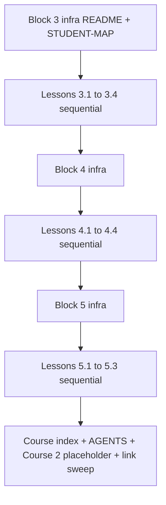

# Plan: Complete Course 1 — Blocks 3–5

**Status:** implemented  
**Date:** 2026-06-06  
**Target:** Course 1, Blocks 3–5 — Lessons 3.1–5.3 (11 lessons + block infra + course index)  
**Supersedes:** (none — first Course 1 completion plan)

## Goal

Finish **Course 1: Python Basics & Command Line Magic** for age 11+ by implementing **Blocks 3–5** (11 lessons), following Block 1/2 conventions:

- Replace the Block 3 placeholder (Lesson 3.1 stub) and add Lessons 3.2–3.4
- Create Block 4 (Organizing Code) and Block 5 (Creative Turtle) from scratch
- Every lesson: bilingual README + `en.md`/`ru.md`, runnable `starter/` + `solution/`, Path A/B, expected output, Debug corner
- After **each** lesson: run scripts locally → readonly **verify-lesson-in-block** subagent → file improvements/gaps under `documents/`
- Add course-level index, update `AGENTS.md`, remove all Course 1 `*(coming soon)*` stubs, hand off to Course 2 placeholder

**Prerequisite:** [Block 2 readiness checklist](../../course-1-python-basics/block-2-talking-to-python/README.md#block-2-readiness-checklist) complete.

**Out of scope:** Block 2 polish in [documents/issues/block-2-talking-to-python-gaps.md](../issues/block-2-talking-to-python-gaps.md); git commit unless requested.

**CURRICULUM.md:** No changes expected — Block 3.4, 4.4 capstone, and Block 5 already documented there.

---

## Current state

| Block | Lessons | Status |
|-------|---------|--------|
| [Block 1](../../course-1-python-basics/block-1-meeting-your-computer/README.md) | 1.1–1.5 | **Complete** |
| [Block 2](../../course-1-python-basics/block-2-talking-to-python/README.md) | 2.1–2.5 | **Complete** |
| Block 3 | 3.1–3.4 | **Complete** |
| Block 4 | 4.1–4.4 | **Complete** |
| Block 5 | 5.1–5.3 | **Complete** |

**Remaining deliverables:** 11 lessons (1 replace + 10 new) + 3 block indexes + 3 STUDENT-MAP pairs (EN/RU) + `course-1-python-basics/README.md` + Course 2 handoff placeholder.

**`*(coming soon)*` links to remove (grep before FIN step):**

- `block-2-talking-to-python/README.md` — Block 3 link
- `block-2-talking-to-python/lesson-2-5-creator-data-pack/README.md` — Lesson 3.1 link
- `block-3-making-choices/lesson-3-1-booleans/` — README, `en.md`, `ru.md` (full replace)

---

## Lessons from CURRICULUM.md

### Block 3: Making Choices & Repeating Actions — theme **Quest Gate**

| Lesson | Topic | Mini-project / outcome |
|--------|-------|------------------------|
| 3.1 | Booleans and Comparisons | `true_false_quiz.py` — predict/compare results in terminal |
| 3.2 | `if`, `elif`, `else` | `choose_path.py` — 2–3 branch story via `input()` |
| 3.3 | `for` and `while` loops | `countdown.py` + `times_table.py` (two scripts, one lesson) |
| 3.4 | Loop Patterns *(block culmination)* | `ascii_pattern.py` — nested loops, grid or pyramid |

**No Block 3 capstone folder** — unlike Blocks 1, 2, and 4. Lesson 3.4 + Block 3 readiness checklist gate Block 4.

### Block 4: Organizing Code — theme **Adventure Workshop**

| Lesson | Topic | Mini-project / outcome |
|--------|-------|------------------------|
| 4.1 | Functions with `def` | `helpers.py` — `draw_banner()`, `ask_yes_no()` |
| 4.2 | Lists | `inventory.py` — append items, numbered list *(CURRICULUM also mentions high-score list as stretch)* |
| 4.3 | Dictionaries | `character_stats.py` — keys like `"hp"`, `"name"` |
| 4.4 | **Capstone: Text Adventure** | `my_adventure/game.py` at **project root** (mirror `my_mission/`, `my_data/`) |

### Block 5: Creative Python with Turtle — theme **Turtle Studio**

| Lesson | Topic | Mini-project / outcome |
|--------|-------|------------------------|
| 5.1 | Turtle Basics | `shapes.py` — square + triangle |
| 5.2 | Loops & Color | `spiral.py` or `star.py` |
| 5.3 | Functions + Turtle | `snowflake.py` — reusable `draw_branch()` |

---

## Lesson flow

```mermaid
flowchart LR
  L25[2.5 Creator Data Pack]
  L31[3.1 Booleans]
  L32[3.2 if elif else]
  L33[3.3 Loops]
  L34[3.4 Loop Patterns]
  L41[4.1 Functions]
  L42[4.2 Lists]
  L43[4.3 Dicts]
  L44[4.4 Text Adventure]
  L51[5.1 Turtle Basics]
  L52[5.2 Loops Color]
  L53[5.3 Functions Turtle]
  C2[Course 2 placeholder]
  L25 --> L31 --> L32 --> L33 --> L34 --> L41 --> L42 --> L43 --> L44 --> L51 --> L52 --> L53 --> C2
```



---

## Standard lesson package (inherit from Blocks 1–2)

Path: `course-1-python-basics/block-{N}-{slug}/lesson-{B}-{L}-{slug}/`

```
README.md       # Chooser + What you'll build/learn + Before you start + Quick drills
en.md / ru.md   # 8 sections: Title, Explanation, Code Example, Code Execution,
                # Quick drills, Practice, Debug corner, What's next
starter/        # Runnable skeleton (# TODO where student fills in)
solution/       # Reference answer
exercises/      # Optional EN + RU micro-challenges (see matrix below)
```

Apply [write-lesson](../../.cursor/skills/write-lesson/SKILL.md), [youth-python-pedagogy](../../.cursor/skills/youth-python-pedagogy/SKILL.md), and the richer README pattern from [block-2-talking-to-python.md](block-2-talking-to-python.md).

**Every lesson must include:**

- Path A (`cd` into PyCourse lesson folder) **and** Path B (copy script anywhere)
- Expected output after every run block
- Debug corner with one real mistake
- "What's next" → next lesson's `README.md` (not `en.md`)
- No type hints; stdlib only (Turtle in Block 5 is stdlib)
- Placeholder output in empty starters so silent runs do not confuse beginners
- Line budget: ~20–35 lines (early Block 3) → ~40–50 (Block 4 capstone) → ~30–45 (Turtle)

**Exercises matrix (optional folders):**

| Lesson | Exercises? | Notes |
|--------|------------|-------|
| 3.1 | No | Keep first boolean lesson lean |
| 3.2 | No | Story branches are enough practice |
| 3.3 | Yes | e.g. `loop_drills.md` + `.ru.md` |
| 3.4 | Yes | e.g. pattern variations |
| 4.1 | No | Two helpers in one script |
| 4.2 | Yes | high-score stretch from CURRICULUM |
| 4.3 | Yes | phonebook-style lookup |
| 4.4 | Yes | capstone extension prompts |
| 5.1–5.3 | 5.3 only | optional `branch_variations` for snowflake |

**Per-lesson verification (repeat 11×):**

1. Run `python starter/...` and `python solution/...` (Turtle: confirm window stays open)
2. Launch readonly **verify-lesson-in-block** subagent ([SKILL](../../.cursor/skills/verify-lesson-in-block/SKILL.md))
3. File findings using **exact** naming from the skill:

```
documents/ideas/block-3-making-choices-lesson-3-1-improvements.md
documents/issues/block-3-making-choices-lesson-3-1-gaps.md
```

4. Fix critical gaps before the next lesson; re-verify if needed
5. Update block README table + STUDENT-MAP progress ticks

**Optional after each block completes:** rollup file `documents/ideas/block-{N}-{slug}-improvements.md` (mirror Block 1/2).

---

## Gamified analogies

### Block 3 — Quest Gate

| Concept | Analogy |
|---------|---------|
| `True` / `False` | Quest pass / quest fail stamp |
| `==`, `>`, `<` | Compare two inventory counts |
| `if` / `elif` / `else` | Fork in the quest path |
| `while` | Repeat until the timer hits zero |
| `for` + `range()` | March through numbered checkpoints |
| `break` | Emergency exit from a loop |

### Block 4 — Adventure Workshop

| Concept | Analogy |
|---------|---------|
| `def` | Blueprint for a reusable spell |
| List `[]` | Backpack inventory (ordered slots) |
| Dict `{}` | Character stat sheet (labeled fields) |
| Capstone | Mini dungeon with rooms and items |

### Block 5 — Turtle Studio

| Concept | Analogy |
|---------|---------|
| `turtle.forward()` | Pen walks across paper |
| `turtle.left()` | Turn the pen |
| Loop + color | Rainbow factory |
| Function + turtle | Stamp the same snowflake branch twice |

---

## Lesson-by-lesson content plan

### Block 3

#### Lesson 3.1 — Booleans and Comparisons *(replace placeholder in place)*

**Path:** `block-3-making-choices/lesson-3-1-booleans/`  
**Time:** ~30 min  
**Outcome:** `starter/true_false_quiz.py` prints labeled results of comparisons

| Section | Content |
|---------|---------|
| Title EN | Level 11 — True or False Quest |
| Explanation | `True`/`False`; `==`, `!=`, `>`, `<`, `>=`, `<=`; `and`/`or` with two comparisons |
| Code Example | Print `"5 == 5:"`, result; mix int and string comparisons |
| Debug Corner | **`=` vs `==`** — assignment vs comparison |
| Files | `starter/true_false_quiz.py`, `solution/true_false_quiz.py` |

**Do not reintroduce variables/input** — assume Block 2 complete. No `if` yet (that's 3.2).

#### Lesson 3.2 — if, elif, else

**Path:** `lesson-3-2-if-elif-else/`  
**Outcome:** `choose_path.py` — 2–3 branch story  
**Debug Corner:** Missing `:` after `if`

#### Lesson 3.3 — for and while loops

**Path:** `lesson-3-3-for-and-while-loops/`  
**Outcome:** Two scripts in one lesson folder:

| Script | Skill | Run command |
|--------|-------|-------------|
| `countdown.py` | `while`, decrement counter | `python starter\countdown.py` |
| `times_table.py` | `for`, `range()` | `python starter\times_table.py` |

README must list **both** scripts with separate expected output. Teach `while` first, then `for`.  
**Debug Corner:** Infinite loop — forgot to update counter inside `while`

#### Lesson 3.4 — Loop Patterns *(block culmination)*

**Path:** `lesson-3-4-loop-patterns/`  
**Outcome:** `ascii_pattern.py` — `*` grid or pyramid via nested loops  
**New skills:** `range(start, stop, step)`, `break`  
**Debug Corner:** Off-by-one in `range()` stop value

**Block 3 readiness checklist (draft):**

- [ ] I can predict comparison results (`==`, `>`, `<`, `and`, `or`)
- [ ] I can write `if` / `elif` / `else` with correct colons and indent
- [ ] I can write a `while` loop that eventually stops
- [ ] I can use `for` with `range()` and complete one ASCII pattern

---

### Block 4

#### Lesson 4.1 — Functions

**Path:** `block-4-organizing-code/lesson-4-1-functions/`  
**Outcome:** `helpers.py` — `draw_banner(text)` + `ask_yes_no(question)` returning `"yes"`/`"no"` strings  
**Debug Corner:** Defined function but forgot to **call** it

#### Lesson 4.2 — Lists

**Path:** `lesson-4-2-lists/`  
**Outcome:** `inventory.py` — `append()`, print numbered list with `for`  
**Debug Corner:** `IndexError` on empty list  
**Stretch (exercises):** high-score list variant from CURRICULUM

#### Lesson 4.3 — Dictionaries

**Path:** `lesson-4-3-dictionaries/`  
**Outcome:** `character_stats.py` — `{}`, key lookup, introduce `.get()` for safe lookup  
**Debug Corner:** `KeyError` on typo key — show fix with correct key or `.get()`

#### Lesson 4.4 — Text Adventure Capstone

**Path:** `lesson-4-4-text-adventure-capstone/`  
**Student project:** `my_adventure/game.py` at repo root (lesson provides `starter/game.py` skeleton)  
**Scope (~45–50 lines):** rooms as dict of dicts; `show_room()`, `move()`; list inventory; simple win condition  
**Constraints:** No classes, no file I/O, no new pip packages  
**Debug Corner:** Mixing list index `[0]` with dict key `["north"]`

**Block 4 readiness checklist (draft):**

- [ ] I can define and call a function with parameters and `return`
- [ ] I can build a list, append items, and loop through it
- [ ] I can read and update values in a dictionary
- [ ] I completed `my_adventure/game.py`

---

### Block 5

#### Lesson 5.1 — Turtle Basics

**Path:** `block-5-creative-turtle/lesson-5-1-turtle-basics/`  
**Outcome:** `shapes.py` — square + triangle  
**Debug Corner:** Forgot `turtle.done()` — window closes instantly

#### Lesson 5.2 — Loops and Color

**Path:** `lesson-5-2-loops-and-color/`  
**Outcome:** `spiral.py` **or** `star.py` (pick one in implementation; document choice in lesson)  
**Debug Corner:** Invalid color name string; window opens behind VS Code

#### Lesson 5.3 — Functions and Turtle

**Path:** `lesson-5-3-functions-and-turtle/`  
**Outcome:** `snowflake.py` — `draw_branch()` reused  
**Debug Corner:** Wrong indent inside `def` — turtle draws in wrong place

**Turtle block README — parent sidebar:**

- Turtle window may open **behind** VS Code — check taskbar
- Every script ends with `turtle.done()`
- Close the window or press Ctrl+C in terminal to stop

**Block 5 readiness checklist (draft):**

- [ ] I can draw basic shapes with `forward()` and `left()`
- [ ] I used a loop to repeat turtle drawing steps
- [ ] I combined a function with turtle commands

---

## Block infrastructure

| Block | Create |
|-------|--------|
| Block 3 | `README.md`, `STUDENT-MAP.md`, `STUDENT-MAP.ru.md`, readiness checklist; **replace** 3.1 content |
| Block 4 | New folder `block-4-organizing-code/` + same infra files |
| Block 5 | New folder `block-5-creative-turtle/` + same infra + Turtle parent tips |

STUDENT-MAP must include Path B table, folder tree through `my_adventure/`, and progress tick list (mirror Block 2).

---

## Cross-cutting updates

| File | Change |
|------|--------|
| [AGENTS.md](../../AGENTS.md) | Add Block 3–5 lesson tables + development order through 5.3 |
| [course-1-python-basics/README.md](../../course-1-python-basics/README.md) | **New** — course index linking all 5 blocks + exit skills |
| [README.md](../../README.md) | Update status line when Course 1 complete |
| Block 2 README + 2.5 README | Remove `*(coming soon)*` on Block 3 / 3.1 links |
| Block 3–4 READMEs | Chain "Next block" links forward |
| **Course 2 handoff** | Create minimal `course-2-web-apps/README.md` placeholder (folder absent today) pointing to [CURRICULUM.md](../../CURRICULUM.md) Block 0; Block 5 README links there |

---

## Dependencies

| Dependency | Why |
|------------|-----|
| Block 2 complete | Variables, `input()`, f-strings, `int()`, string basics |
| Block 2 readiness checklist | Gates Block 3 entry in lesson 3.1 README |
| [block-2-talking-to-python.md](block-2-talking-to-python.md) implemented | Conventions reference |
| verify-lesson-in-block skill | Mandatory per-lesson QA + document filing |

---

## Implementation order



1. Mark this plan `approved` after optional peer review (see [Open questions](#open-questions))
2. Block 3 infra → Lessons 3.1 → 3.2 → 3.3 → 3.4
3. Block 4 infra → Lessons 4.1 → 4.2 → 4.3 → 4.4
4. Block 5 infra → Lessons 5.1 → 5.2 → 5.3
5. Course wrap-up: `course-1-python-basics/README.md`, `AGENTS.md`, `course-2-web-apps/README.md`, root `README.md`, grep for `coming soon`

**Estimated deliverables:** ~85–95 new/edited files (11 lessons × ~7–8 files + 3 blocks × ~4 files + course index + placeholders).

---

## Implementation steps

- [x] Peer review this plan → `approved`
- [x] Block 3 — README + STUDENT-MAP (EN/RU) + checklist
- [x] Lesson 3.1 — replace placeholder (`true_false_quiz.py`)
- [x] Lesson 3.2 — `choose_path.py`
- [x] Lesson 3.3 — `countdown.py` + `times_table.py`
- [x] Lesson 3.4 — `ascii_pattern.py` + exercises
- [x] Block 4 — folder + README + STUDENT-MAP + checklist
- [x] Lessons 4.1–4.4 (capstone `my_adventure/` pattern)
- [x] Block 5 — folder + README + STUDENT-MAP + Turtle parent tips
- [x] Lessons 5.1–5.3
- [x] `course-1-python-basics/README.md`
- [x] `course-2-web-apps/README.md` placeholder
- [x] Update `AGENTS.md` + root `README.md`
- [x] Remove all Course 1 `coming soon` stubs; verify navigation 2.5 → … → 5.3 → Course 2
- [x] Mark plan `implemented`; update [README.md](README.md) registry

---

## Done criteria

- [x] All 21 Course 1 lessons exist with bilingual README, `en.md`, `ru.md`
- [x] Every code lesson has runnable `starter/` and `solution/`
- [x] Blocks 3, 4, 5 each have README + readiness checklist + STUDENT-MAP (EN/RU)
- [x] Navigation chain intact: 2.5 → 3.1 → … → 5.3 → Course 2 handoff
- [x] No `*(coming soon)*` stubs in Course 1 lesson bodies
- [x] All starter/solution scripts run locally (Turtle lessons open window until closed)
- [x] Verification filed for each new/updated lesson under `documents/ideas/` and `documents/issues/`
- [x] Plan status → `implemented`; registry row updated

**Not in scope:** Block 2 gap fixes; Course 2 Block 0 lessons; git commit unless requested.

---

## Open questions (for review before `approved`)

1. **Lesson 3.3 dual scripts:** Is two run commands in one lesson acceptable for age 11+, or should we split into 3.3a/3.3b? *Default: keep one lesson with clear README sections for each script.*
2. **Block 5.2 project:** `spiral.py` vs `star.py` — pick one during implementation and note in lesson title.
3. **Lesson 4.3 `.get()`:** Teach in main Explanation or only in Debug corner? *Default: brief intro in Explanation when showing typo-safe lookup.*
4. **Capstone room count:** Two rooms + win room, or three playable rooms? *Default: 2–3 rooms to stay under ~50 lines.*
5. **Course 2 placeholder depth:** README stub only vs. Block 0.1 placeholder lesson folder? *Default: course README stub mirroring Block 3 placeholder pattern.*
