# Plan: Complete Course 2 — Blocks 0–2

**Status:** implemented  
**Date:** 2026-06-08  
**Target:** Course 2, Blocks 0–2 — Lessons 0.1–2.5 (11 lessons + block infra + course index)  
**Supersedes:** (none — first Course 2 build plan)

## Goal

Build **Course 2: Web Applications with Python** for age 11+ — Flask routes, templates, forms, CSS, and two capstone web apps:

- Create Blocks 0, 1, and 2 with bilingual indexes and STUDENT-MAPs
- Every lesson: README + `en.md`/`ru.md`, runnable `starter/` + `solution/` (Flask apps where applicable)
- Dual student projects: URL calculator (Block 1) + form calculator (Block 2) + Mad-Libs capstone (Block 2)
- **Bulk verification** at end → file gaps to `documents/issues/`, improvements to `documents/ideas/` → fix all gaps
- Update `AGENTS.md`, remove "Coming soon" from course README

**Prerequisite:** [Course 1 Block 5 readiness checklist](../../course-1-python-basics/block-5-creative-turtle/README.md#block-5-readiness-checklist) complete.

**Out of scope:** git commit unless requested; Course 3 lesson content; stretch goals (sessions, SQLite, deploy).

---

## Current state

| Block | Lessons | Status |
|-------|---------|--------|
| [Block 0](../../course-2-web-apps/block-0-environment-setup/README.md) | 0.1–0.2 | **Complete** |
| [Block 1](../../course-2-web-apps/block-1-web-basics-flask/README.md) | 1.1–1.4 | **Complete** |
| [Block 2](../../course-2-web-apps/block-2-making-it-beautiful-interactive/README.md) | 2.1–2.5 | **Complete** |

**Deliverables:** 11 lessons + 3 block indexes + 3 STUDENT-MAP pairs (EN/RU) + [course-2-web-apps/README.md](../../course-2-web-apps/README.md) + [course-3-game-dev placeholder](../../course-3-game-dev/README.md).

Verification: [documents/issues/course-2-verification-gaps.md](../issues/course-2-verification-gaps.md) (resolved) · Improvements: [documents/ideas/course-2-verification-improvements.md](../ideas/course-2-verification-improvements.md).

---

## Lessons from CURRICULUM.md (with dual-project design)

### Block 0: Environment Setup — theme **Web Workshop Setup**

| Lesson | Topic | Mini-project / outcome |
|--------|-------|------------------------|
| 0.1 | Virtual Environments & pip | Create `.venv`, install Flask, understand why |
| 0.2 | How the Web Works | Browser, server, URL, request/response (concept + diagram) |

**Scope split (0.1 vs 1.1):** 0.1 = venv + pip mechanics; 1.1 = verify Flask import (no re-teaching venv).

### Block 1: Web Basics with Flask — theme **Route Lab**

| Lesson | Topic | Mini-project / outcome |
|--------|-------|------------------------|
| 1.1 | Installing Flask | `pip show flask`, import check inside venv |
| 1.2 | First Web Page | "Hello, Web World!" at `localhost:5000` |
| 1.3 | Dynamic Routes | `/hello/<name>` personalized greeting |
| 1.4 | Multiple Routes | Mini-site + URL calculator (`/add/<int:a>/<int:b>`) — **calc track A** |

### Block 2: Making It Beautiful & Interactive — theme **Studio Pages**

| Lesson | Topic | Mini-project / outcome |
|--------|-------|------------------------|
| 2.1 | HTML Templates | Jinja2 base layout + child pages |
| 2.2 | HTML Forms (GET/POST) | Form echoing user input |
| 2.3 | Mad-Libs Capstone | `my_web_madlibs/` at project root — **project track B** |
| 2.4 | Static Files & CSS | Linked stylesheet, simple responsive styling |
| 2.5 | Flash & Validation | Flash messages + POST calculator in `my_web_calc/` — **calc track A (forms)** |

---

## Shared conventions

- **Venv:** `.venv` inside each lesson's `starter/` Flask project
- **Run:** `python starter\app.py` from lesson dir (Windows); `python starter/app.py` (Mac/Linux)
- **Port:** `5000`, `debug=True`
- **Layout:** `starter/app.py`; `templates/` from 2.1+; `static/` from 2.4+
- **Code:** 30–80 lines per main example; no type hints required
- **Bilingual:** English/Russian headings localized; same steps and code
- **Navigation:** "What's next" → next lesson `README.md`

---

## Implementation phases

| Phase | Task | Status |
|-------|------|--------|
| 1 | Scaffold — block folders, READMEs, STUDENT-MAPs, course index | **Done** |
| 2 | Lessons — 11 bilingual packages with starter/solution (parallel tracks A/B/C) | **Done** |
| 3 | Bulk verify — gaps + improvements filed under `documents/` | **Done** |
| 4 | Fix gaps — navigation, `check_setup.py`, plan doc | **Done** |
| 5 | Wrap-up — `AGENTS.md`, `CURRICULUM.md` outcomes, course README | **Done** |

---

## Lesson flow

```mermaid
flowchart LR
  L01[0.1 venv pip]
  L02[0.2 web works]
  L11[1.1 Flask]
  L12[1.2 first page]
  L13[1.3 dynamic]
  L14[1.4 mini-site calc]
  L21[2.1 templates]
  L22[2.2 forms]
  L23[2.3 madlibs]
  L24[2.4 CSS]
  L25[2.5 flash calc]
  L01 --> L02 --> L11 --> L12 --> L13 --> L14 --> L21 --> L22 --> L23 --> L24 --> L25
```

---

## Key references

- [write-lesson skill](../../.cursor/skills/write-lesson/SKILL.md)
- [youth-python-pedagogy skill](../../.cursor/skills/youth-python-pedagogy/SKILL.md)
- [Course 1 block 4 pattern](../../course-1-python-basics/block-4-organizing-code/)
- [CURRICULUM.md](../../CURRICULUM.md) lines 79–113
